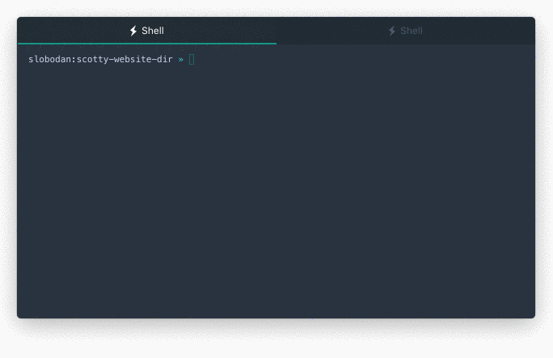

# Scotty.js

Deploy static websites or folders to AWS S3 with a single command

<h1 align="center">
  
  <br/>
</hr>

[](https://travis-ci.org/stojanovic/scottyjs)
[](https://www.npmjs.com/package/scottyjs)
[](https://www.npmjs.com/package/scottyjs)
[](https://github.com/stojanovic/scottyjs/blob/master/LICENSE)
[](https://gitter.im/scottyjs/scotty?utm_source=badge&utm_medium=badge&utm_campaign=pr-badge&utm_content=badge)	

## Install

Scotty.js is available on NPM. Install it as a global dependency to be able to use `scotty` command anywhere:

```shell
npm install scottyjs --global
```

## Use

> Beam me up, Scotty



To deploy a static folder to AWS S3 run:

 ```shell
scotty {options}
 ```

or

```shell
beam-me-up {options}
```

### Available options

- _--help_ or _-h_ - Print this help
- _--version_ or _-v_ - Print the current version
- _--quiet_ or _-q_ - Suppress output when executing commands (default: false)
- _--website_ or _-w_ - Set uploaded folder as a static website (default: false)
- _--spa_ - Set uploaded folder as a single page app (default: false)
- _--source_  or _-s_ - Source of the folder that will be uploaded (default: current folder)
- _--bucket_ or _-b_ - Name of the S3 bucket (default: name of the current folder)
- _--region_ or _-r_ - AWS region where the files will be uploaded, default: saved region if exists or a list to choose one if it is not saved yet
- _--force_ or _-f_ - Update the bucket without asking (default: false, forced region can be overridden with _-r_)
- _--update_ or _-u_ - Update existing bucket (default: false)

### Examples

#### _Create React App_ application

Full tutorial: http://medium.com/@slobodan/single-command-deployment-for-single-page-apps-29941d62ef97

To deploy [CRA](https://github.com/facebookincubator/create-react-app) apps simply run `npm run build` in your project root folder to create build version.

Then deploy build version using following command:

```shell
scotty --spa --source ./build
```

Or, if you want to specify bucket name run:

```shell
scotty --spa --source ./build --bucket some-bucket-name
```

With `--spa` flag, Scotty will set required redirects for your single page app, so your app can use pushState out of the box.

## Test

We use [Jasmine](https://jasmine.github.io/) for unit and integration tests. Unless there is a very compelling reason to use something different, please continue using Jasmine for tests. The existing tests are in the [spec](spec) folder. Here are some useful command shortcuts:

Run all the tests:

```bash
npm test
```

Run only some tests:

```bash
npm test -- filter=prefix
```

Get detailed hierarchical test name reporting:

```bash
npm test -- full
```
## License

MIT -- see [LICENSE](LICENSE)
